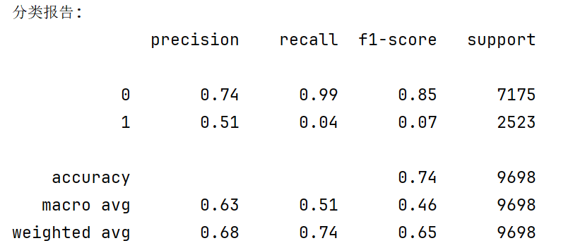
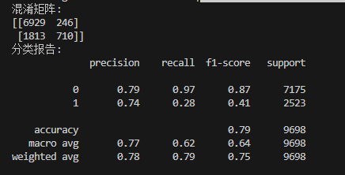
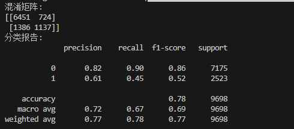
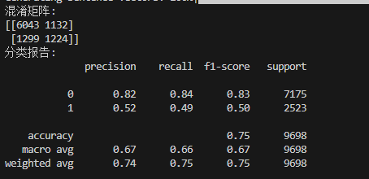
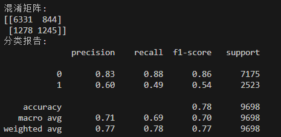
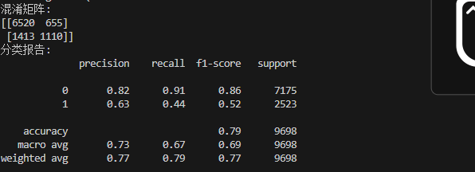
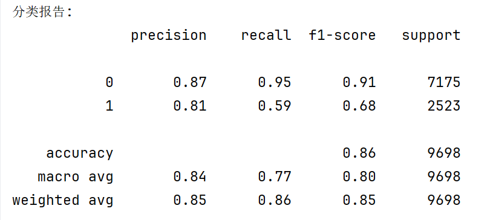
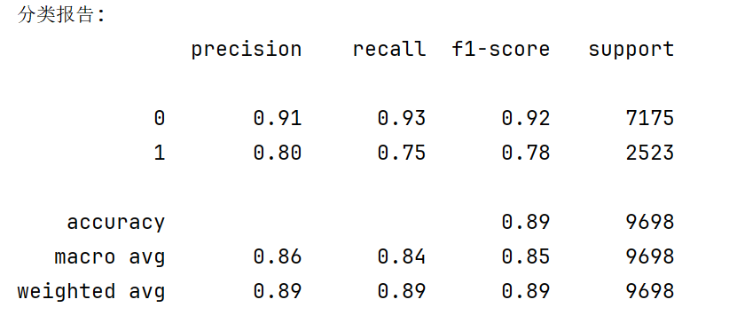
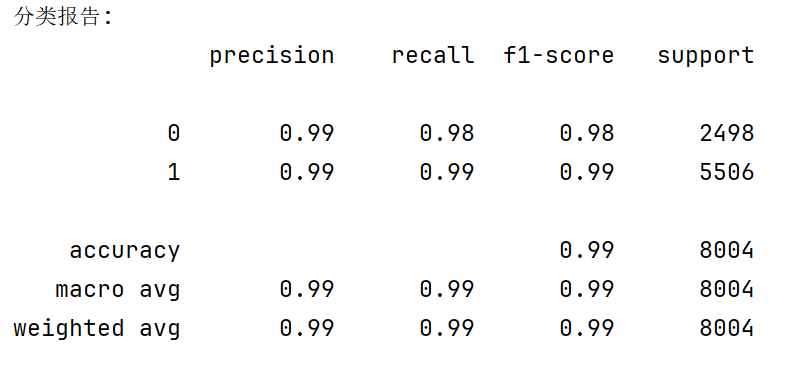

# 微博欺凌文本检测
## 一、背景
网络欺凌（cyberbullying）作为一种特定的垃圾文本形式，不仅影响个体心理健康和社会和谐，还对网络平台、社区文化及法律合规性产生深远影响。

- **心理伤害的严重性**：网络欺凌（如辱骂、歧视性评论）可能导致受害者出现焦虑、抑郁甚至极端行为，尤其对青少年和弱势群体影响更大。通过检测恶意评论能帮助识别和过滤这些有害内容，减轻对受害者的心理伤害。
- **社会影响**：网络欺凌常针对特定群体，可能引发群体性争议或网络暴力，破坏网络社区的信任和凝聚力。
- **实时性需求**：网络欺凌可能在短时间内引发广泛传播（如热门话题下的恶意评论），需要快速检测和干预。
- **危害性更高**：与广告、垃圾邮件等传统垃圾文本相比，网络欺凌对个体和社会的直接危害更大（如心理创伤、群体对立）。优先检测网络欺凌能更有效地减少网络社会的负面影响。

从网络社会的角度，选择网络欺凌检测是因为它直接关乎个体心理健康、平台声誉、法律合规性和公平包容的网络文化构建。相比其他垃圾文本，网络欺凌的危害更严重、复杂性更高，且受到社会广泛关注。
## 二、数据来源与预处理
### 1、来源
* 数据来源于[BullyDataset](https://github.com/NijiaLu/BullyDataset)，为从新浪微博评论中收集的中文微博评论数据集。
* 该数据集用于网络欺凌检测，如果出现以下情况将被视为欺凌：
  1. 使用性别歧视、种族或地理诽谤。
  2. 使用脏话或羞辱来指责某人，而没有充分的论据。
  3. 公然歪曲事实或试图以毫无根据的主张歪曲对少数人的看法。
  4. 表达对少数群体的暴力或诅咒倾向。
  5. 包含对外表、身体或家庭成员的攻击。
  6. 就是反复的负面评论之一，或者号召他人加入攻击。
  7. 强加了一个别人不愿意接受或侮辱的昵称
---
### 2、数据预处理
* 初始数据格式为：时间、评论内容、三位标注者的判断。标签类别：0为非恶评，1为恶评。如`6月10日 23:51	官博发的消息比我发的还慢	0	0	0`。
* 由于本次实验数据格式如下：`0	有问题，可能她还有个男朋友要处理，你们一人分两个月的时间`，仅有一个标签和文本。为方便训练，我们对数据进行了处理：
  * 首先对于每条评论按照制表符分割，得到字段列表。只有评论包含时间、评论内容以及三个二元标注时，才能算有效评论，否则跳过。
  * 对于三个人的评价，我们根据评价数量来判断是否为恶评，即少数服从多数。具体在`mapping_dict`已写出映射表。
  * 如果映射存在，生成格式为`标签\t文本`的字符串，为处理后的结果。
    ```python
    def process_weibo_data(file_content):
    """
    Processes Weibo data content with updated mapping rules.
    """
    mapping_dict = {
        "000": "0", "001": "0", "010": "0", "100": "0",
        "011": "1", "101": "1", "110": "1", "111": "1"
    }
    processed_lines = []

    lines = file_content.strip().splitlines()

    for line in lines:
        parts = line.strip().split('\t')
        if len(parts) >= 5:
            try:
                text = parts[1]
                anns = [p.strip() for p in parts[2:5]]  # 取第3-5列作为标注

                # 验证标注有效性
                if all(a in {'0', '1'} for a in anns):
                    key = ''.join(anns)
                    if key in mapping_dict:
                        processed_lines.append(
                            f"{mapping_dict[key]}\t{text}"
                        )
            except (IndexError, ValueError):
                continue  # 跳过格式异常的行

    return processed_lines
    ```
---
### 3、额外处理
* 问题：**预定义字典包含字符数量不够**：对于个别繁体字和生僻字类（如“饞”），原有代码（`utils.py`）中`ChineseCharacterCoder`的`structure_code = self.structure_dict[hanzi]`尝试在标准字典中查找它作为键`self.structure_dict`却找不到。
* 解决方法：修改`generate_glyph_code`**添加预定义默认值**：
    ```python
    # 在原有基础上加入默认值
        default_structure = '0'  
        default_fcc = '00000'  
        default_stroke = '0'  
    ```
    * `default_structure = '0'`：当汉字不在 `structure_dict` 中时，使用 '0' 作为默认结构编码。避免程序崩溃，保证字形编码结构一致。
    * `default_fcc = '00000'`：四角编码表示未知形状，避免缺失值。
    * `default_stroke = '0'`：由于无法获取笔画数，使用0作为默认笔画数。
* 对于此类生僻字变体字，这些字符可能不在标准字典中。默认值确保这些字符能被编码和处理，增强模型对新兴欺凌表达的检测能力。

## 三、模型调优与优化
清洗好了微博评论数据集，我们用原有模型进行了文本检测，结果并不理想（恶评的召回率接近 0 ）：

这可能是因为传统垃圾文本分类任务的主要目标是识别含有广告链接、非法营销、博彩推广等内容的文本，而**微博欺凌评论检测的目标则是识别带有攻击性、歧视性或伤害性的言语**，其表现形式更加复杂，标签的定义更加语义化，判断标准包括歧视、攻击、侮辱、讽刺等，依赖更高层次的语言理解，原模型中训练得到的决策边界难以转移。
针对微博欺凌文本的特征，我们对模型进行了下面的调优与优化：

---
### 1、特征工程
#### （1）攻击性关键词匹配特征


为了捕捉明显具有攻击性的语言内容，本文构建了四类关键词词典，并统计每条评论中命中的关键词数量作为特征输入：

1. `BULLY_KEYWORDS`：侮辱性攻击词典

该词典包含大量用于直接侮辱他人的粗口和蔑称，如：

* “废物”、“傻逼”、“脑残”、“狗杂种”等。

该特征反映文本中是否存在强烈侮辱、辱骂类词汇，**数量越多攻击性越强**。

2. `GROUP_SENSITIVE_KEYWORDS`：群体歧视攻击词典

该词典包含对特定群体的歧视、贬低、地域或性别偏见表达，例如：

* “死胖子”、“阿三”、“乡下人”、“残疾”等。

该特征用于捕捉**针对群体身份的攻击倾向**，反映偏见与仇恨言论。

3. `NEGATIVE_PHRASES`：情绪化负面攻击短语

用于识别情绪强烈但不一定使用侮辱词的攻击行为，如：

* “受不了”、“搞他”、“一起攻击”、“举报到封号”等。

该类短语往往出现在**组织攻击、鼓动网暴或表达极端负面情绪**的评论中。

4. `INTENSIFIERS`：情绪强化标点特征

该词典包括表示愤怒、讽刺或激烈情绪的符号序列，如：

* “！！！”、“？？？”、“。。。？？”、“！！？？”。

这些符号能显著加强语气强度，是识别攻击评论中常见的表现方式。

---

#### （2）结构性特征提取函数：`extract_additional_features`
```python
def extract_additional_features(texts, fit=False, vectorizer=None, tfidf_max_features=300):
    url_pattern = re.compile(r'https?://|www\.|\.com|\.cn|\.net')

    all_feature_rows = []

    for text in texts:
        # URL数量
        url_count = len(url_pattern.findall(text))

        # 情感倾向
        try:
            sentiment = SnowNLP(text).sentiments
        except ZeroDivisionError:
            sentiment = 0.5

        # 词典匹配
        bully_count = sum(text.count(word) for word in BULLY_KEYWORDS)
        group_count = sum(text.count(word) for word in GROUP_SENSITIVE_KEYWORDS)
        neg_phrase_count = sum(text.count(word) for word in NEGATIVE_PHRASES)
        intensifier_count = sum(text.count(word) for word in INTENSIFIERS)

        all_feature_rows.append([
            url_count,
            sentiment,
            bully_count,
            group_count,
            neg_phrase_count,
            intensifier_count,
        ])

    manual_features = np.array(all_feature_rows)  # N×7

    # TF-IDF 特征拼接
    if vectorizer is None or fit:
        vectorizer = TfidfVectorizer(max_features=tfidf_max_features)
        tfidf_matrix = vectorizer.fit_transform(texts).toarray()
    else:
        tfidf_matrix = vectorizer.transform(texts).toarray()

    # 合并
    final_features = np.hstack([manual_features, tfidf_matrix])

    return final_features, vectorizer
```


该函数以每条文本为单位，提取以下数值型特征构成“人工特征向量”：

| 特征名                 | 含义说明                                   |
| ------------------- | -------------------------------------- |
| `url_count`         | 文本中是否含有 URL、短链等标识，判断是否为营销/攻击跳转         |
| `sentiment`         | 使用 SnowNLP 分析评论的情感倾向，值越低越负面（0\~1）      |
| `bully_count`       | 命中攻击性关键词（`BULLY_KEYWORDS`）的总次数         |
| `group_count`       | 命中群体歧视词（`GROUP_SENSITIVE_KEYWORDS`）的次数 |
| `neg_phrase_count`  | 命中负面短语词典的总次数                           |
| `intensifier_count` | 命中情绪强化符号的次数（如“！！！”、“？？？”）              |

这些特征最终组合为一个 `N × 6` 的手工特征矩阵。

---

#### （3） TF-IDF 特征构建

为了增强模型对高频重要词的语义理解能力，使用 `TfidfVectorizer` 对文本提取 unigram 特征，保留 `max_features=300` 的高频词。其优势在于：

* 能覆盖部分攻击关键词的“近义表达”；
* 对于带有暗示性的关键词有良好的加权效果；
* 易于与统计特征和深层表示拼接。

---

#### （4）最终特征向量拼接

在获取 `sentence_vectors`（基于字嵌入的句子向量）后，将其与上述提取的手工统计特征和 TF-IDF 特征拼接，构成最终的输入特征 `full_vectors`：

```python
# 特征工程
    extra_features, tfidf_vectorizer = extract_additional_features(cleaned_text, fit=True)
    full_vectors = np.hstack([sentence_vectors, extra_features])
```
下面是加入特征工程后的结果：

可以看到恶评的准确率和召回率都有一定提升。

### 2、分类器选择
尽管特征工程起到了一些成效，但还是不尽人意。为此我们决定寻找更适合微博欺凌评论检测任务的分类器，我们对多种主流机器学习模型进行了对比评估。各模型的选型如下：
```python
# clf = LogisticRegression(max_iter=1000)

    # clf = XGBClassifier(
    #     n_estimators=400,
    #     max_depth=6,
    #     learning_rate=0.08,
    #     subsample=0.9,
    #     colsample_bytree=0.9,
    #     scale_pos_weight=2.84,  
    #     reg_alpha=0.2,
    #     reg_lambda=2.0,
    #     use_label_encoder=False,
    #     eval_metric='logloss',
    #     random_state=42
    # )

    # clf = SGDClassifier(
    #     loss='hinge',  # SVM
    #     class_weight='balanced',
    #     max_iter=1000,
    #     tol=1e-3
    # )

    # clf = RandomForestClassifier(
    #     n_estimators=300,
    #     max_depth=10,
    #     class_weight='balanced_subsample',
    #     random_state=42
    # )

    clf = LGBMClassifier(
        num_leaves=64,
        n_estimators=300,
        learning_rate=0.1,
        class_weight='balanced'
    )
```


#### （1） 逻辑回归（原模型）

逻辑回归是广泛应用的线性分类模型，具有良好的可解释性和稳定性。然而，由于该模型线性假设较强，在处理非线性边界、复杂语言结构和弱攻击语义时表现有限，**容易对语义欺凌文本出现误判或漏判**。

---

#### （2） 支持向量机（SGDClassifier，Hinge Loss）

为提高对复杂边界的判别能力，尝试使用随机梯度下降训练的线性支持向量机（SVM）模型。采用 `'hinge'` 作为损失函数，并启用 `class_weight='balanced'` 处理类别不均衡问题。但**对隐含语义攻击建模能力较弱**，对 Recall 的提升有限。

---

#### （3） 随机森林（Random Forest）

使用 `n_estimators=300`、`max_depth=10` 的随机森林模型进行实验，具有较强的特征建模能力和鲁棒性。虽然其对结构性攻击文本有较好识别能力，但对于变体词、语义讽刺等文本表现力不足，且容易在训练数据量大时过拟合。

---

#### （4） XGBoost 分类器（XGBClassifier）

XGBoost 是性能强大的梯度提升树模型，在综合表现上优于逻辑回归和随机森林，但训练速度不如后续的 LightGBM。

---

#### （5） LightGBM 分类器（最终选定模型）

最终选用的模型为 LightGBM（Light Gradient Boosting Machine），其优势包括：

* 更高的训练效率与更低的内存占用；
* 原生支持类别不平衡处理（`class_weight='balanced'`）；
* 能有效利用高维稀疏特征和结构性统计特征；
* 与 TF-IDF、攻击性关键词等特征配合良好。

初步配置如下：

```python
num_leaves=64,
n_estimators=300,
learning_rate=0.1,
class_weight='balanced'
```
### 3、融合语义判断
更改分类器后结果还是没达到预期。为此，我们在结构特征模型（LightGBM）基础上，引入了基于预训练语言模型的语义分类器 —— **BERT + MLP**，并采用**加权融合策略**综合两类模型的预测结果。

---

#### （1） BERT 模型结构设计

采用中文预训练模型 `bert-base-chinese`，并在其基础上添加轻量级全连接层组成最终分类器：

* 使用 BERT 输出的 `[CLS]` 向量（`pooler_output`）作为整体句向量；
* 接入 `Dropout(0.3)` 降低过拟合风险；
* 最后通过一层 `Linear(hidden_size, 2)` 实现二分类输出。

**模型结构简述：**

```text
Input → BERT → Pooler Output → Dropout → Linear → Logits（2类）
```

---

#### （2） 训练配置与过程

BERT 模型在训练集中微调了 5 个 epoch，使用如下设置：

| 参数项        | 设置                         |
| ---------- | -------------------------- |
| 优化器        | AdamW（learning\_rate=2e-5） |
| 损失函数       | CrossEntropyLoss           |
| Batch Size | 训练：16，测试：32                |
| Max Length | 128 tokens                 |
| Epoch      | 5                          |
| 使用设备       | 自动检测 GPU (`cuda`)          |

训练过程中，每轮循环中，模型按批加载数据，通过 `input_ids` 与 `attention_mask` 输入至 BERT，并根据标签计算交叉熵损失，反向传播优化。

---

#### （3） BERT 模型预测

训练完成后，模型对测试集逐条预测，并输出属于类别 1（欺凌评论）的概率值。通过 `softmax` 得到二维概率向量后，保留第二类的概率（`probs[:, 1]`）用于融合。

该部分逻辑如下：

```python
logits = bert_model(input_ids, attention_mask)
probs = torch.softmax(logits, dim=1)[:, 1]  # 类别1概率
```

---

#### （4） 融合策略设计（Soft Voting）

为了结合结构攻击特征（由 LightGBM 提供）与深层语义判断（由 BERT 提供），本文采用**加权平均融合策略（Soft Voting）**：

$$
P_{\text{final}} = \alpha \cdot P_{\text{LGBM}} + (1 - \alpha) \cdot P_{\text{BERT}}
$$

* 本实验中，设置权重系数 $\alpha = 0.6$，即结构模型占比略高；
* 融合后的概率经阈值 $0.5$ 二值化为最终预测标签。

```python
final_proba = 0.6 * proba_lgb + 0.4 * proba_bert
final_pred = (final_proba >= 0.5).astype(int)
```

融合预测结果如下：


可以看到恶评的检测能力得到很大改善。

### 4、调参
最后我们对 LGBM 模型进行进一步调参：
```python
    clf = LGBMClassifier(
        num_leaves=31,
        n_estimators=100,
        learning_rate=0.05,
        class_weight='balanced',
        max_depth=7,
        min_child_samples=20,
        reg_alpha=0.1,
        reg_lambda=0.1,
        objective='binary',
        metric='binary_logloss'
    )
```
各参数的意义如下：
  * `num_leaves=31`：指定每棵树的最大叶子结点数，控制决策树的复杂性。
  * `n_estimators=100`：指定梯度提升框架中决策树的数量。
  * `learning_rate=0.05`：学习率。
  * `class_weight='balanced'`：自动调整类别权重以处理不平衡数据集，减少偏向多数类的风险。
  * `max_depth=7`：设置最大树深度，防止过拟合。
  * `min_child_samples=20`：指定每个叶子结点最少样本数，确保叶子结点有足够样本支持。
  * `reg_alpha=0.1`：L1正则化，惩罚特征权重，增加模型稀疏性。
  * `reg_lambda=0.1`：L2正则化，惩罚特征权重的平方，平滑模型。
  * `objective='binary'`：指定任务类型为二分类。
  * `metric='binary_logloss'`：指定优化的评估指标为二分类对数损失。
#### 最终结果：

## 四、模型泛化性验证
在实验后期，我们对改进后的模型在原始的传统垃圾文本分类任务上进行了测试，发现其性能相比最初的模型也有明显提升：

这表明，当前改进方案不仅有效提升了微博欺凌评论检测性能，同时也具备良好的迁移性和泛化性，**在更广泛的垃圾文本检测任务中同样适用**。

## 五、总结
本次面向**微博平台的网络欺凌评论检测**任务，围绕中文语言特点与攻击语言风格，构建了结构 + 语义融合的多维特征体系，并依次对模型性能进行改进与优化。实验得出如下关键结论：

* **原始垃圾文本检测模型难以适应语义欺凌**：广告类垃圾文本与网络攻击在特征层面存在明显差异，前者以链接/重复模板为主，后者则表现为隐蔽、讽刺、歧视性语言，传统模型召回率极低。

* **多层次特征工程是性能提升关键**：通过设计攻击关键词、歧视词、情绪短语、URL数量、情感倾向等多种手工统计特征，并融合 TF-IDF 词频表示与字嵌入句向量，显著增强了模型的表达能力。

* **LightGBM 是结构攻击的有效建模器**：相比传统线性模型，LightGBM 能更好地识别基于攻击词、情绪强化符号构成的典型恶评，且训练高效，适合快速部署。

* **引入 BERT 提升语义理解能力**：BERT 模型能捕捉语境中讽刺、隐喻、假关心等复杂攻击手法，是结构模型的有效补充。在融合策略中，BERT 提升了模型对隐性欺凌的 Recall。

* **融合模型表现最佳**：采用加权融合（Soft Voting）策略，结合 LightGBM 与 BERT 模型的输出概率，达成结构攻击与语义攻击的互补检测能力，整体性能最优。

* **最终模型效果优良**：融合模型 Recall 与 F1 均明显优于各单一模型，尤其在召回偏低问题上取得显著改善，具备良好的实用价值与推广前景。
* **模型泛化性强**：在改善了微博欺凌评论检测性能的同时也改善了对原始垃圾文本的检测。

